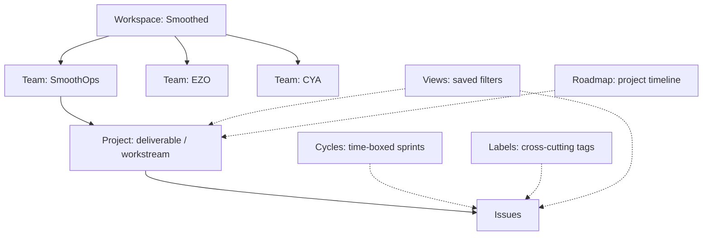
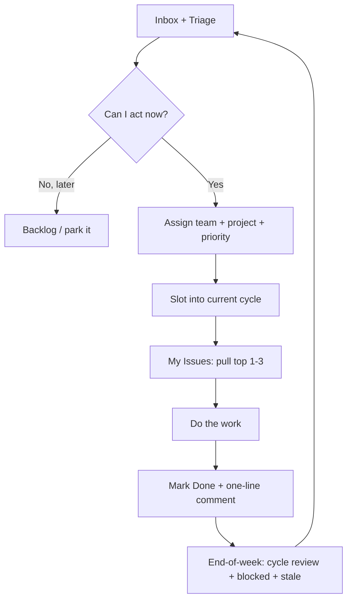

# Linear Power-User Guide

> How to run Smoothed (and its client work) day-to-day in Linear without losing context.

## The mental model

Linear is **not a spreadsheet of todos** and it does **not** have a single BI-style
dashboard. It is a **triage loop**:

- Everything lands in **Inbox** (notifications) or **Triage** (unsorted issues).
- You sort it: assign team + project + priority, slot it into a cycle, or park it.
- You pull from **My Issues**, do the work, mark Done, and add a one-line comment.

Power users don't "check a dashboard" — they check **Inbox → My Issues → Blocked**,
three views, thirty seconds, and full context is back.

## Object hierarchy



The four axes that make Views powerful:

- **Team** = who owns it
- **Project** = the deliverable
- **Cycle** = when it ships
- **Label** = how it cuts across everything

## The day-to-day loop



The habits that matter:

1. **Triage hits zero every morning.** Every issue is scheduled, assigned, or consciously parked.
2. **Inbox hits zero at end of day.** Read → act → archive.
3. **Low WIP.** Only a handful of things in "In Progress" at once. The only things
   in "In Progress" should be things you (or an agent) are actively doing.

## Views (your actual "dashboard")

Most of these are **built-in** in Linear. You only need to create a couple of custom
ones and pin the rest.

| View | Built-in? | Question it answers | Filter / where |
|------|-----------|--------------------|----------------|
| **Inbox** | yes | What needs attention right now? | `I` key, or the bell |
| **Triage** | yes | What hasn't been sorted yet? | team "Triage" view |
| **My Issues** | yes | What am I personally accountable for? | `G` then `M`, or `assignee:me` |
| **Active** (per team) | yes | What is the team actually pushing? | team view → "Active" |
| **Backlog** (per team) | yes | What's queued and needs grooming? | team view → "Backlog" |
| **Roadmap** | yes | What's coming this quarter? | "Roadmap" in sidebar |
| **Blocked** | **no — create** | What's stuck and needs unblocking? | `label:blocked,on-hold` |
| **By agent** | **no — create** | What is each agent doing? | `label:agent:zed,agent:claude,agent:headless` |

### Custom view recipes (create in the UI)

**Blocked** — a team-scoped view on SmoothOps:

- Filter: `label` → `blocked` and `on-hold` (multiple label values = OR)
- Display: list, grouped by project

**By agent** — a team-scoped view on SmoothOps:

- Filter: `label` → `agent:zed`, `agent:claude`, `agent:headless`
- Display: board, grouped by label

> Note: Linear's public GraphQL API has **no `viewCreate` mutation** — views are
> UI-only. That's why these two are "create in the UI", not scripted.

## Charts & metrics (the honest part)

Linear has **cycle progress bars** and the **Roadmap**, but **no native BI charts**
(burn-up, velocity, throughput, "days in progress", "blocked-issue age"). If you want
real numbers/charts, pull the data through the API and chart it yourself.

## SmoothOps setup (already live)

- **Team:** SmoothOps (key `OPS`)
- **Projects:** Go-To-Market, Personal Brand, Invoicing & Finance, Platform & Tooling, Admin & Legal
- **Cycle:** `#1 Week of Aug 31` (2026-08-31 → 2026-09-06), weekly cadence
- **Seeded issues:** `OPS-5` … `OPS-15`

### Labels to add (one-time)

| Label | Purpose |
|-------|---------|
| `blocked` | Work that can't progress |
| `on-hold` | Work intentionally paused |
| `agent:zed` | Work this agent is driving |
| `agent:claude` | Work Claude is driving |
| `agent:headless` | Work a headless/batch worker is driving |

The `blocked` / `on-hold` labels are what the toolkit's `health_check()` and
`stale_issues()` already scan for — keep the names exact.

## Toolkit interface

`api-toolkit/services/linear/api.py` is the client (`LINEAR_API_KEY` in `.env`).
Team keys and names both resolve to IDs, so use `team="OPS"` or `team="SmoothOps"`.

```python
from services.linear.api import LinearAPI
api = LinearAPI()

api.list_issues(team="OPS", status="In Progress")  # what's moving
api.list_cycles("OPS")                              # this week's sprint
api.health_check()                                  # overdue + stale + blocked rollup
api.stale_issues(days=7)                            # in-progress with no update in N days
api.blocked_issues()                                # label:blocked / label:on-hold
api.create_issue(team="OPS", title="...", project="Go-To-Market", priority=2)
api.create_cycle(team="OPS", name="Week of Sep 7", starts_at="2026-09-07T00:00:00.000Z", ends_at="2026-09-13T23:59:59.000Z")
```

**Restore context after a shuffle:**

```python
api.list_issues(team="OPS", limit=50)   # everything on the plate
api.health_check()                       # what's at risk
api.stale_issues()                       # what's gone quiet
```

## Agent convention

For any non-trivial chunk of work: **file (or claim) a Linear issue at start, mark it
Done (or In Review) at finish, and label it `blocked`/`on-hold` if it stalls.** See the
`## Linear Integration (SmoothOps)` section of `AGENTS.md`.
